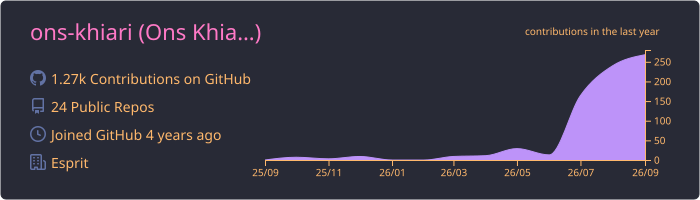
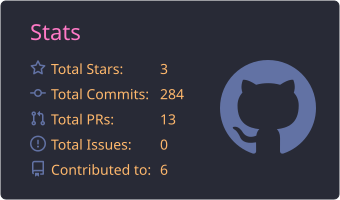
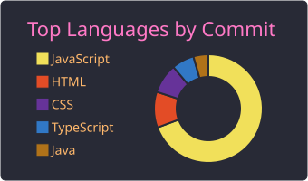

  

  &nbsp;
  &nbsp;
  

## 👩‍💻 About Me

- 🚀 Software engineer building full-stack web applications
- ⚛️ Frontend with **React**, **Next.js** and **TypeScript**
- 🛠️ Backend with **Node.js / Express** and **.NET (C#)**
- 🗄️ Data with **PostgreSQL**, **MySQL**, **MongoDB** and **Prisma**
- 📫 Reach me at **onskhiari2001@gmail.com**

 

## 💻 Tech Stack

   
  

## 📊 GitHub Stats

  

  
  

  

## 🐍 Contribution Snake

  <picture>
    <source media="(prefers-color-scheme: dark)" srcset="https://raw.githubusercontent.com/ons-khiari/ons-khiari/output/github-snake-dark.svg" />
    <source media="(prefers-color-scheme: light)" srcset="https://raw.githubusercontent.com/ons-khiari/ons-khiari/output/github-snake.svg" />
    
  </picture>

  

